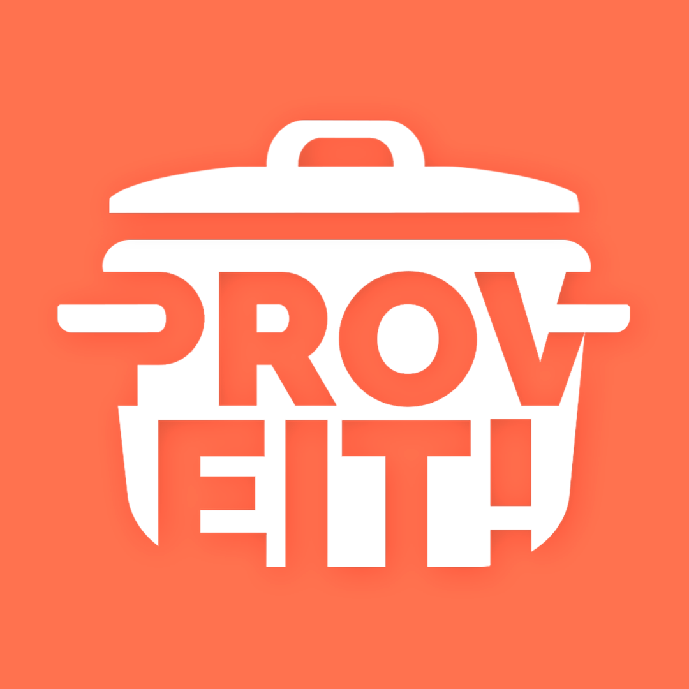

#  ProveIt
👋 _Bem-vindo(a) ao nosso projeto!_

## 🥘 O que é ProveIt?
É o projeto de nós, **uma equipe de estudantes da Etec**, para um aplicativo de auxílio culinário. Nosso objetivo é **ajudar as pessoas** em seu ambiente doméstico com as suas refeições e **alimentação em geral**.

## 💭 Mas, como?
A ideia por trás do nosso objetivo se baseia nas _**features**_. Estamos trabalhando para que as funcionalidades do ProveIt sejam de fácil uso, e, acima de tudo, **úteis** para o usuário final.

**Principais funcionalidades incluem:**

- 🔎 _Pesquisa por ingredientes_
- 🥪 _Identificação de receitas com ingredientes reaproveitáveis_
- 🍗 _Identificação de calorias presentes_
- 👤 _Feedback do usuário_

Entre outras!

## 👨‍💻 O desenvolvimento
🤔 _Onde estamos?_

O nosso projeto já tem bases sólidas. Estamos em estágios avançados de desenvolvimento, com 90% das telas prontas, um banco de dados completo, diversas features já funcionais e um back-end em desenvolvimento ativo.

## Tecnologias usadas
     

## 📆 Quando?
O lançamento do aplicativo é previsto para **meados de junho / julho**, estando disponível para dispositivos Android, também na PlayStore.

Estamos ansiosos para compartilhar mais com vocês!
